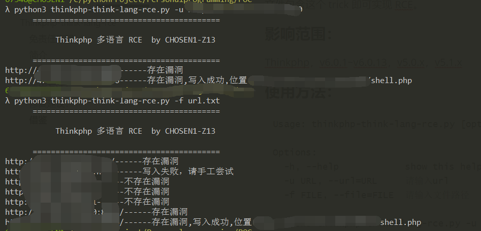

##                                          Thinkphp-think-lang-rce

### 免责任声明：

该工具仅供学习和参考。因用于其他用途而产生不良后果,作者不承担任何法律责任。

本工具仅能在取得足够合法授权的企业安全建设中使用，在使用本工具过程中，您应确保自己所有行为符合当地的法律法规。 如您在使用本工具的过程中存在任何非法行为，您将自行承担所有后果，本工具所有开发者和所有贡献者不承担任何法律及连带责任。 除非您已充分阅读、完全理解并接受本协议所有条款，否则，请您不要安装并使用本工具。 您的使用行为或者您以其他任何明示或者默示方式表示接受本协议的，即视为您已阅读并同意本协议的约束

### 简介：

一个用于自检thinphp多语言漏洞的工具，日后再做相关完善。

如果 Thinkphp 程序开启了多语言功能，那就可以通过 get、header、cookie 等位置传入参数，实现目录穿越+文件包含，通过 pearcmd 文件包含这个 trick 即可实现 RCE。

### 影响范围：

Thinkphp，v6.0.1~v6.0.13，v5.0.x，v5.1.x

### 使用方法：

```
Usage: thinkphp-think-lang-rce.py [options]

Options:
  -h, --help            show this help message and exit
  -u URL, --url=URL     请输入url
  -f FILE, --file=FILE  请输入文件路径

python3 thinkphp-think-lang-rce.py -u url 单个url测试

python3 thinkphp-think-lang-rce.py -f url.txt 多个url测试
```



### 修复建议：

官方已发布6.0.14、5.1.42，建议升级至安全版本，链接如下：

https://github.com/top-think/framework/tags

### 借鉴：

https://tttang.com/archive/1865/

